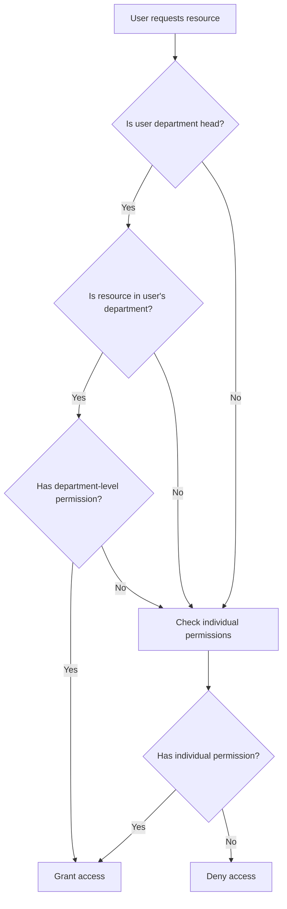

# Hybrid Permissions System

A comprehensive permissions system that supports both fine-grained individual permissions and department-level access for department heads.

## Overview

The hybrid permissions system provides two levels of access control:

1. **Fine-grained permissions**: Individual permissions like `kpi.view`, `invoice.approve`, etc.
2. **Department-level permissions**: Broad access to all resources within a department for department heads

## Architecture

### Permission Types

#### Individual Permissions
- `kpi.view`, `kpi.create`, `kpi.edit`, `kpi.delete`
- `invoice.view`, `invoice.approve`, `invoice.edit`
- `project.view`, `project.create`, `project.edit`, `project.delete`
- `user.view`, `user.edit`, `user.manage_roles`

#### Department-Level Permissions
- `department_kpis.view`, `department_kpis.create`, `department_kpis.edit`, `department_kpis.delete`
- `department_invoices.view`, `department_invoices.approve`, `department_invoices.edit`
- `department_projects.view`, `department_projects.create`, `department_projects.edit`, `department_projects.delete`
- `department_users.view`, `department_users.manage_roles`, `department_users.manage_permissions`

### User Roles

#### Department Head Role
- **Role Name**: `department_head`
- **Access**: Department-level permissions for their assigned department
- **Scope**: All resources within their department
- **Fallback**: Can still access individual resources if they have specific permissions

#### Regular Users
- **Access**: Fine-grained individual permissions
- **Scope**: Specific resources they have been granted access to
- **Management**: Permissions assigned individually or through roles

## Database Schema

### Updated Tables

#### `permissions` Table
```sql
-- New department-level resource types
ALTER TYPE public.resource_type ADD VALUE 'department_kpis';
ALTER TYPE public.resource_type ADD VALUE 'department_invoices';
ALTER TYPE public.resource_type ADD VALUE 'department_projects';
ALTER TYPE public.resource_type ADD VALUE 'department_users';
```

#### `user_permissions` Table
```sql
-- Added department_id column for department-level permissions
ALTER TABLE public.user_permissions 
ADD COLUMN department_id uuid REFERENCES public.departments(department_id);
```

### New Database Functions

#### `can_access_department_resources()`
```sql
CREATE OR REPLACE FUNCTION public.can_access_department_resources(
  check_user_id uuid,
  target_department_id uuid,
  resource_type text,
  action text
)
RETURNS boolean
```

#### `is_department_head()`
```sql
CREATE OR REPLACE FUNCTION public.is_department_head(check_user_id uuid)
RETURNS boolean
```

#### `get_user_department()`
```sql
CREATE OR REPLACE FUNCTION public.get_user_department(check_user_id uuid)
RETURNS uuid
```

## Usage Examples

### For Department Heads

#### Checking Department-Level Access
```typescript
import { useDepartmentAccess } from '@/hooks/usePermissions'

function DepartmentKPIsPage({ departmentId }: { departmentId: string }) {
  const { hasAccess, loading } = useDepartmentAccess(departmentId, 'kpi', 'view')
  
  if (loading) return <div>Loading...</div>
  if (!hasAccess) return <div>Access denied</div>
  
  return <div>Department KPIs content</div>
}
```

#### Server-Side Department Access Check
```typescript
import { serverPermissionService } from '@/lib/services/permissions'

// Check if user can access department KPIs
const canAccess = await serverPermissionService.canAccessDepartmentResources(
  userId,
  departmentId,
  'kpi',
  'view'
)
```

### For Regular Users

#### Individual Permission Check
```typescript
import { usePermission } from '@/hooks/usePermissions'

function KPIPage() {
  const { hasPermission } = usePermission('kpi.view')
  
  if (!hasPermission) return <div>Access denied</div>
  
  return <div>KPI content</div>
}
```

### For Administrators

#### Assigning Department Head Role
```typescript
// Assign department head role to a user
await supabase
  .from('user_roles')
  .insert({
    user_id: userId,
    role: 'department_head'
  })
```

#### Assigning Department-Level Permissions
```typescript
// Assign department-level permission to a user
await supabase
  .from('user_permissions')
  .insert({
    user_id: userId,
    permission_id: permissionId,
    department_id: departmentId
  })
```

## Permission Checking Logic

### Hierarchy of Access

1. **Direct User Permission**: Check if user has specific permission
2. **Role-Based Permission**: Check if user's role grants the permission
3. **Department-Level Permission**: Check if user is department head with department-level access
4. **Individual Permission Fallback**: Check if user has individual permission for the resource

### Department Head Access Flow



## API Endpoints

### Department Access Check
```
POST /api/permissions/department-access
```

**Request Body:**
```json
{
  "department_id": "uuid",
  "resource_type": "kpi",
  "action": "view"
}
```

**Response:**
```json
{
  "hasAccess": true,
  "user_id": "uuid",
  "department_id": "uuid",
  "resource_type": "kpi",
  "action": "view"
}
```

## UI Components

### Department Access Hook
```typescript
export function useDepartmentAccess(
  departmentId: string,
  resourceType: string,
  action: string
): {
  hasAccess: boolean | null
  loading: boolean
  error: string | null
  refetch: () => Promise<void>
}
```

### Permission Utils
```typescript
export class PermissionUtils {
  // Check if resource is department-level
  static isDepartmentLevelResource(resource: ResourceType): boolean
  
  // Convert individual permission to department-level
  static toDepartmentLevelPermission(resource: ResourceType, action: PermissionAction): string
  
  // Check if user is department head
  static async isDepartmentHead(service: PermissionService, userId: string): Promise<boolean>
  
  // Get user's department
  static async getUserDepartment(service: PermissionService, userId: string): Promise<string | null>
}
```

## RLS Policies

### Updated KPI Policy
```sql
CREATE POLICY "Users can view KPIs with permission or department access"
  ON public.kpis FOR SELECT
  TO authenticated
  USING (
    public.user_has_permission(auth.uid(), 'kpi.view', jsonb_build_object('department_id', department_id)) OR
    public.can_access_department_resources(auth.uid(), department_id, 'kpi', 'view')
  );
```

### Updated Invoice Policy
```sql
CREATE POLICY "Users can view invoices with permission or department access"
  ON public.invoices FOR SELECT
  TO authenticated
  USING (
    public.user_has_permission(auth.uid(), 'invoice.view', jsonb_build_object('department_id', department_id)) OR
    public.can_access_department_resources(auth.uid(), department_id, 'invoice', 'view')
  );
```

## Migration Guide

### From Old Role-Based System

1. **Deploy Database Migration**: Run the department-level permissions migration
2. **Assign Department Head Roles**: Update existing department heads to use `department_head` role
3. **Update UI Components**: Replace role-based checks with permission-based checks
4. **Test Access**: Verify department heads can access all department resources

### Example Migration

```typescript
// Old role-based check
if (userRole === 'team_leader' && userDepartment === targetDepartment) {
  // Grant access
}

// New permission-based check
const hasAccess = await serverPermissionService.canAccessDepartmentResources(
  userId,
  targetDepartment,
  'kpi',
  'view'
)
```

## Benefits

### For Department Heads
- **Simplified Management**: One role grants access to all department resources
- **Unified View**: Access to all KPIs, invoices, and projects in their department
- **Flexible Access**: Can still have individual permissions for specific resources

### For Administrators
- **Granular Control**: Fine-grained permissions for regular users
- **Department Management**: Easy assignment of department-level access
- **Scalable**: System grows with organization structure

### For Regular Users
- **Precise Access**: Only access what they need
- **Clear Permissions**: Explicit permission requirements
- **Consistent Experience**: Same permission system across all resources

## Security Considerations

### Access Control
- **Department Isolation**: Department heads can only access their own department
- **Permission Validation**: All access checks go through the same validation logic
- **Audit Trail**: All permission changes are logged

### Data Protection
- **RLS Enforcement**: Database-level security with Row Level Security policies
- **Context Validation**: Department context is validated for all department-level access
- **Fallback Security**: Multiple layers of permission checking

## Troubleshooting

### Common Issues

1. **Department Head Not Getting Access**
   - Verify user has `department_head` role
   - Check user's department assignment
   - Ensure department-level permissions are assigned to the role

2. **Individual Permissions Not Working**
   - Check if user has specific permission assigned
   - Verify permission name format (`resource.action`)
   - Check RLS policies are updated

3. **Department Access Denied**
   - Verify department ID matches user's department
   - Check if user is department head of the correct department
   - Ensure department-level permissions exist

### Debug Commands

```sql
-- Check if user is department head
SELECT public.is_department_head('user-id');

-- Get user's department
SELECT public.get_user_department('user-id');

-- Check department access
SELECT public.can_access_department_resources('user-id', 'dept-id', 'kpi', 'view');

-- View user's roles
SELECT role FROM public.user_roles WHERE user_id = 'user-id';

-- View user's permissions
SELECT p.name FROM public.user_permissions up
JOIN public.permissions p ON up.permission_id = p.id
WHERE up.user_id = 'user-id';
```

## Future Enhancements

- **Multi-Department Heads**: Users who are heads of multiple departments
- **Temporary Department Access**: Time-limited department-level access
- **Department Delegation**: Department heads delegating access to subordinates
- **Department Hierarchies**: Nested department structures with inherited permissions
